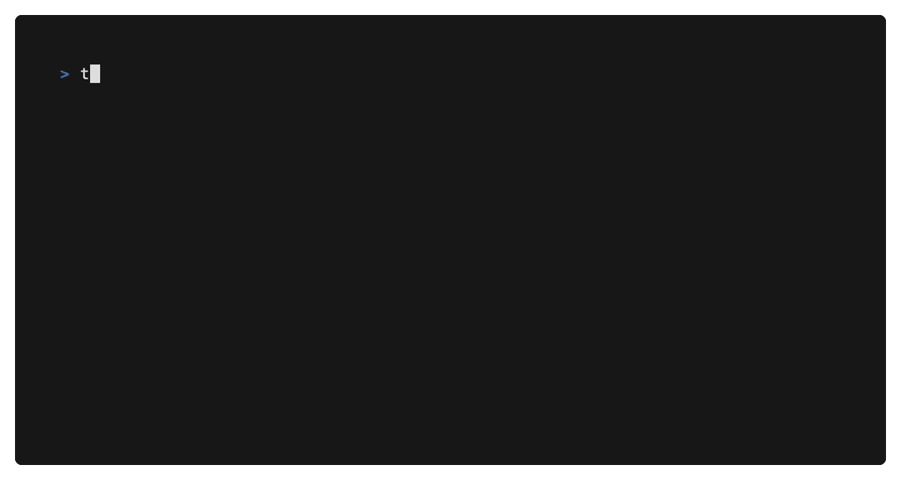

# taint

Implements static [taint analysis](https://en.wikipedia.org/wiki/Taint_checking) for Go programs. 

Taint analysis is a technique for identifying the flow of sensitive data through a program. 
It can be used to identify potential security vulnerabilities, such as SQL injection or 
cross-site scripting (XSS) attacks, by understanding how this data is used and transformed 
as it flows through the code.

A "**source**" is a point in the program where sensitive data originates, typically from user 
input, such as data entered into a form on a web page, or data loaded from an external source. 
A "**sink**" is a point in the program where sensitive data is used or transmitted to exploit 
the program.

## Example

This code generates a function call graph rooted at a program's `main` function and 
then runs taint analysis on it. If the program uses `database/sql`, the taint analysis
will determine if the program is vulnerable to SQL injection such that any of the given
sources reach the given sinks.

```go
cg, _ := callgraph.New(mainFn, buildSSA.SrcFuncs...)

sources := taint.NewSources(
        "*net/http.Request",
        "google.golang.org/protobuf/proto.Message", // gRPC request types
)

sinks := taint.NewSinks(
	"(*database/sql.DB).Query",
	"(*database/sql.DB).QueryContext",
	"(*database/sql.DB).QueryRow",
	"(*database/sql.DB).QueryRowContext",
	"(*database/sql.Tx).Query",
	"(*database/sql.Tx).QueryContext",
	"(*database/sql.Tx).QueryRow",
	"(*database/sql.Tx).QueryRowContext",
)

results, _ := taint.Check(cg, sources, sinks)

for _, result := range results {
	// We found a query edge that is tainted by user input, is it
	// doing this safely? We expect this to be safely done by
	// providing a prepared statement as a constant in the query
	// (first argument after context).
	queryEdge := result.Path[len(result.Path)-1]

	// Get the query arguments, skipping the first element, pointer to the DB.
	queryArgs := queryEdge.Site.Common().Args[1:]

	// Skip the context argument, if using a *Context query variant.
	if strings.HasSuffix(queryEdge.Site.Value().Call.Value.String(), "Context") {
		queryArgs = queryArgs[1:]
	}

	// Get the query function parameter.
	query := queryArgs[0]

	// Ensure it is a constant (prepared statement), otherwise report
	// potential SQL injection.
	if _, isConst := query.(*ssa.Const); !isConst {
		pass.Reportf(result.SinkValue.Pos(), "potential sql injection")
	}
}
```

### `taint`

The `taint` CLI is an interactive tool to find potential security vulnerabilities. It can be used
to find potential SQL injections, log injections, and cross-site scripting (XSS) vulnerabilities, 
among other types of vulnerabilities.

```console
$ go install github.com/picatz/taint/cmd/taint@latest
```



#### Interactive Commands

The `taint` tool provides several interactive commands for exploring callgraphs and analyzing code:

**`load <target> [pattern] [--full]`** - Load a Go program or package for analysis

Targets can be local directories or GitHub URLs. When providing a GitHub URL you may optionally
append a subdirectory or specific file path to restrict loading. This helps when large
repositories contain many commands / `main` packages and you only want
to look at a single entry point.

* `load ./myproject` loads the local module using pattern `./...` (recursive) by default.
* `load https://github.com/user/repo` clones (shallow) and loads only the root package (`.`) by default, not the whole repo.
* `load https://github.com/user/repo/cmd/tool` clones and loads `./cmd/tool` (pattern defaults to `.` under that path).

**`callpath <function>`** - Find call paths to functions with flexible matching strategies:

```console
> callpath fmt.Printf                    # Exact match
> callpath fuzzy:Printf                  # Substring/fuzzy matching  
> callpath glob:fmt.*                    # Shell-style glob patterns
> callpath regex:.*\.(Exec|Query)$       # Regular expressions
```

**Example output:**
```console
> load xss
✓ loaded 1 packages, creating 1 SSA packages
✓ created multi-root callgraph with 3 potential roots

> callpath fuzzy:Check
✓ found 1 path(s) using fuzzy matching for: fuzzy:Check
1: n0:github.com/picatz/taint/xss.run → n8:github.com/picatz/taint.Check

> callpath fuzzy:run  
✓ found 2 path(s) using fuzzy matching for: fuzzy:run
1: n0:github.com/picatz/taint/xss.run (root node)
2: n0:github.com/picatz/taint/xss.run → n9:github.com/picatz/taint.WalkSSA → n10:github.com/picatz/taint/xss.run$1
```

**`check <source> <sink>`** - Perform taint analysis between source and sink functions

```console
> load ./cmd/taint/example
✓ loaded 1 packages, creating 1 SSA packages
  building SSA package 0: main
✓ found main function, using as callgraph root
✓ loaded 1 packages
> cg
n0:github.com/picatz/taint/cmd/taint/example.main
   → n4:database/sql.Open
   → n5:net/http.NewServeMux
   → n6:(*net/http.ServeMux).HandleFunc
   → n8:net/http.ListenAndServe

n1:github.com/picatz/taint/cmd/taint/example.handle
   → n3:(*database/sql.DB).Query

n2:github.com/picatz/taint/cmd/taint/example.business
   → n1:github.com/picatz/taint/cmd/taint/example.handle

n3:(*database/sql.DB).Query

n4:database/sql.Open

n5:net/http.NewServeMux

n6:(*net/http.ServeMux).HandleFunc
   → n7:github.com/picatz/taint/cmd/taint/example.main$1

n7:github.com/picatz/taint/cmd/taint/example.main$1
   → n9:(*net/url.URL).Query
   → n2:github.com/picatz/taint/cmd/taint/example.business

n8:net/http.ListenAndServe

n9:(*net/url.URL).Query

> check *net/http.Request (*database/sql.DB).Query
n0:github.com/picatz/taint/cmd/taint/example.main → n6:(*net/http.ServeMux).HandleFunc → n7:github.com/picatz/taint/cmd/taint/example.main$1 → n2:github.com/picatz/taint/cmd/taint/example.business → n1:github.com/picatz/taint/cmd/taint/example.handle → n3:(*database/sql.DB).Query
> check (*net/url.URL).Query (*database/sql.DB).Query
n0:github.com/picatz/taint/cmd/taint/example.main → n6:(*net/http.ServeMux).HandleFunc → n7:github.com/picatz/taint/cmd/taint/example.main$1 → n2:github.com/picatz/taint/cmd/taint/example.business → n1:github.com/picatz/taint/cmd/taint/example.handle → n3:(*database/sql.DB).Query
```

**Other commands:** `cg` (show callgraph), `nodes` (list nodes), `pkgs` (list packages), `root` (show root), `clear`, `exit`

### `sqli`

The `sqli` [analyzer](https://pkg.go.dev/golang.org/x/tools/go/analysis#Analyzer) finds potential SQL injections.

Supported SQL packages include:

- the standard library `database/sql` package
- `github.com/jinzhu/gorm` (GORM v1)
- `gorm.io/gorm` (GORM v2)
- `github.com/jmoiron/sqlx`
- `github.com/go-gorm/gorm` (GORM v2 alt)
- `xorm.io/xorm` and `github.com/go-xorm/xorm`
- `github.com/go-pg/pg`
- `github.com/rqlite/gorqlite`
- `github.com/raindog308/gorqlite`
- `github.com/Masterminds/squirrel` and variants
- database drivers like `github.com/mattn/go-sqlite3`

```console
$ go install github.com/picatz/taint/cmd/sqli@latest
```

```console
$ cd sql/injection/testdata/src/example
$ cat main.go
package main

import (
        "database/sql"
        "net/http"
)

func business(db *sql.DB, q string) {
        db.Query(q) // potential sql injection
}

func run() {
        db, _ := sql.Open("sqlite3", ":memory:")

        mux := http.NewServeMux()

        mux.HandleFunc("/", func(w http.ResponseWriter, r *http.Request) {
                business(db, r.URL.Query().Get("sql-query"))
        })

        http.ListenAndServe(":8080", mux)
}

func main() {
        run()
}
$ sqli main.go
./sql/injection/testdata/src/example/main.go:9:10: potential sql injection
```

### `logi`

The `logi` [analyzer](https://pkg.go.dev/golang.org/x/tools/go/analysis#Analyzer) finds potential log injections. It understands common logging packages, including `log`, `log/slog`, `github.com/golang/glog`, `github.com/hashicorp/go-hclog`, `github.com/sirupsen/logrus`, and `go.uber.org/zap`.

```console
$ go install github.com/picatz/taint/cmd/logi@latest
```

```console
$ cd log/injection/testdata/src/a
$ cat main.go
package main

import (
        "log"
        "net/http"
)

func main() {
        http.HandleFunc("/", func(w http.ResponseWriter, r *http.Request) {
                log.Println(r.URL.Query().Get("input"))
        })

        http.ListenAndServe(":8080", nil)
}
$ logi main.go
./log/injection/testdata/src/a/main.go:10:14: potential log injection
```

### `xss`

The `xss` [analyzer](https://pkg.go.dev/golang.org/x/tools/go/analysis#Analyzer) finds potential cross-site scripting (XSS) vulnerabilities.

```console
$ go install github.com/picatz/taint/cmd/xss@latest
```

```console
$ cd xss/testdata/src/a
$ cat main.go
package main

import (
	"net/http"
)

func main() {
	http.HandleFunc("/", func(w http.ResponseWriter, r *http.Request) {
		w.Write([]byte(r.URL.Query().Get("input"))) // want "potential XSS"
	})

	http.ListenAndServe(":8080", nil)
}
$ xss main.go
./xss/testdata/src/a/main.go:9:10: potential XSS
```
